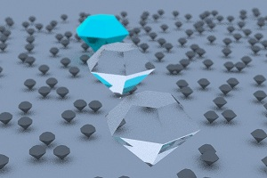

**********************************************************************
		DIAMOND TRACER
		
	Author: Emilija Zdilar
	Version: 1.0.0
	Date: 18.07.2018.

	This project is a Computer Graphics course assignment. 
	It is a ray tracer, written in C++. Image is stored in
	a .ppm format. The main accent is on diamond and sphere
	shaped hitable objects, different materials, camera and 
	antializing.
	 		
**********************************************************************

Getting Started:

- Download and open project
- compile main.cpp
- run executable
- open image.ppm

**********************************************************************

Tips:
- The number of required operations is fairly big. Hence, the height
  and width should be within reason.
 
 Example: 
  

**********************************************************************

Prerequisites:
- c++ compiler
- graphics program that supports the PPM format.

**********************************************************************

Acknowledgments:
- Paško Zdilar
- Ray Tracing from the Ground Up, Kevin Suffern, 2007
- Ray Tracing in One Weekend, Peter Shirley, 2016
- Ray  Tracing: the next Weekend, Peter Shirley, 2016
**********************************************************************
